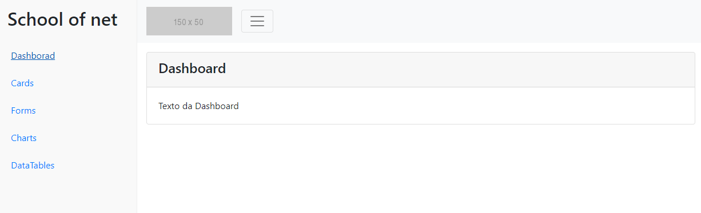
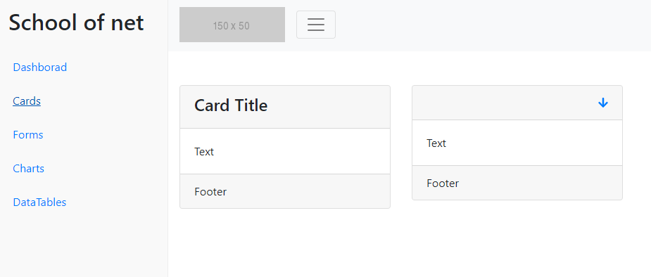
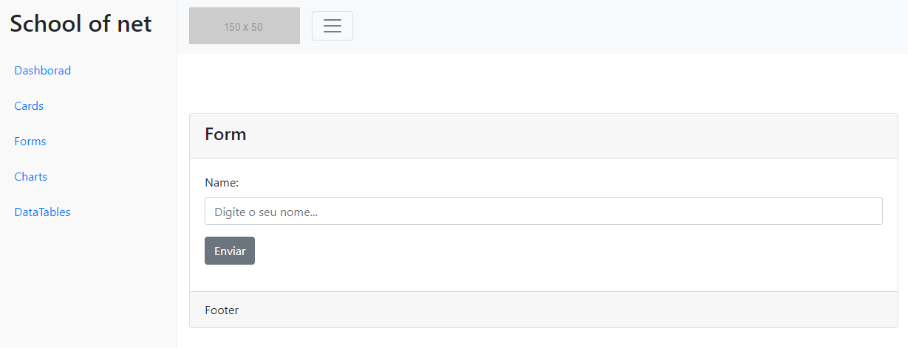
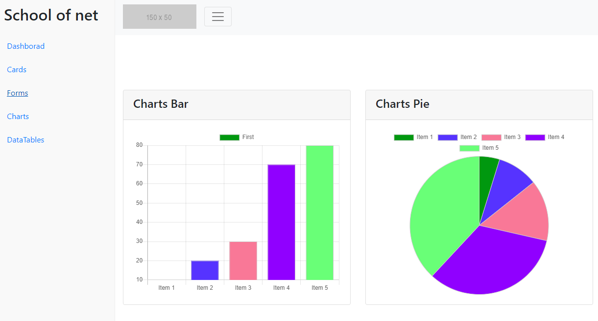
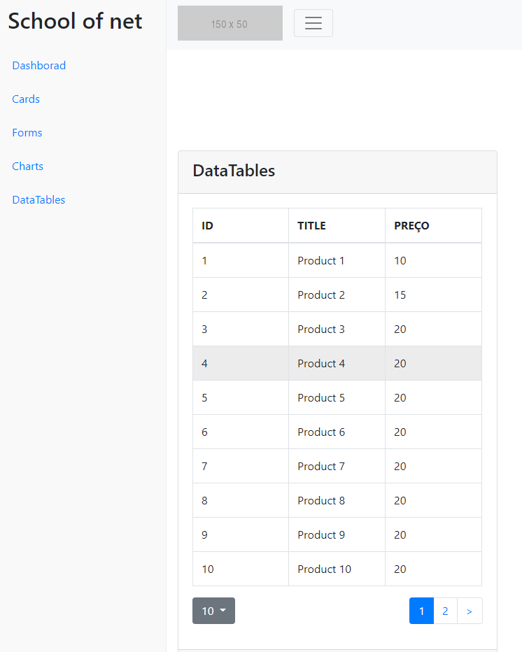
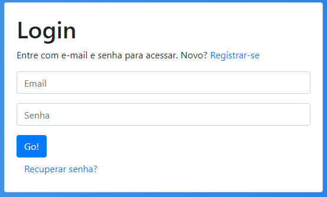
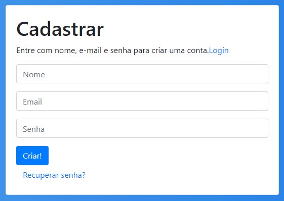
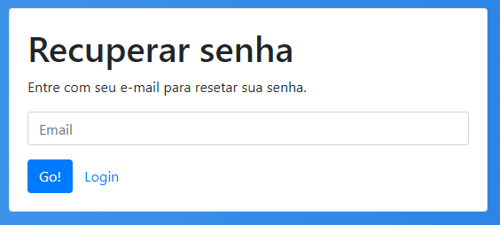

  <a href="#rocket-tecnologias">Tecnologias</a>&nbsp;&nbsp;&nbsp;|&nbsp;&nbsp;&nbsp;
  <a href="#-projeto">Projeto</a>&nbsp;&nbsp;&nbsp;|&nbsp;&nbsp;&nbsp;
  <a href="#-rotas-paginas">Rotas e Páginas</a>&nbsp;&nbsp;&nbsp;|&nbsp;&nbsp;&nbsp;
  <a href="#-como-rodar">Como rodar</a>&nbsp;&nbsp;&nbsp;|&nbsp;&nbsp;&nbsp;
  <a href="#-como-contribuir">Como contribuir</a>&nbsp;&nbsp;&nbsp;

## Admin template com React.js

## 🚀 Tecnologias

Esse projeto foi desenvolvido com as seguintes tecnologias:

- [React Native](https://reactnative.dev/) - 0.63.3
- [Yarn](https://yarnpkg.com/) - 1.22.4
- [Npm](https://www.npmjs.com/) - 6.14.5

## 💻 Projeto

Template com React JS. O layout é divido em rotas externas e internas com visuais diferentes. 
Projeto pratico da School of net - Criando um admin template com React.js [Link](https://www.schoolofnet.com/projeto-pratico/frontend/react/criando-um-admin-template-com-reactjs).

## 🚀 Rotas e Páginas

- Dashboard
Rota: /dashboard
Tipo: interno

  

- Cards 
Rota: /cards
Tipo: interno

  

- Forms 
Rota: /forms
Tipo: interno

  

- Charts 
Rota: /charts
Tipo: interno

  

- DataTables 
Rota: /dataTables
Tipo: interno

  

- 404 
Rota: /404
Tipo: externo

  

- Login 
Rota: /login
Tipo: externo

  

- Register 
Rota: /register
Tipo: externo

  

- Forgot 
Rota: /forgot
Tipo: externo

  

## 🚀 Como Rodar

- Clone o projeto.
- Entre na pasta do projeto e rode yarn install (pode usar npm install de acordo com a sua configuração).
- yarn start para rodar o font (localhost:3000).

## 🤔 Como contribuir

- Faça um fork desse repositório;
- Cria uma branch com a sua feature: `git checkout -b minha-feature`;
- Faça commit das suas alterações: `git commit -m 'feat: Minha nova feature'`;
- Faça push para a sua branch: `git push origin minha-feature`.

Depois que o merge da sua pull request for feito, você pode deletar a sua branch.

## 📝 Licença

Esse projeto está sob a licença MIT.
